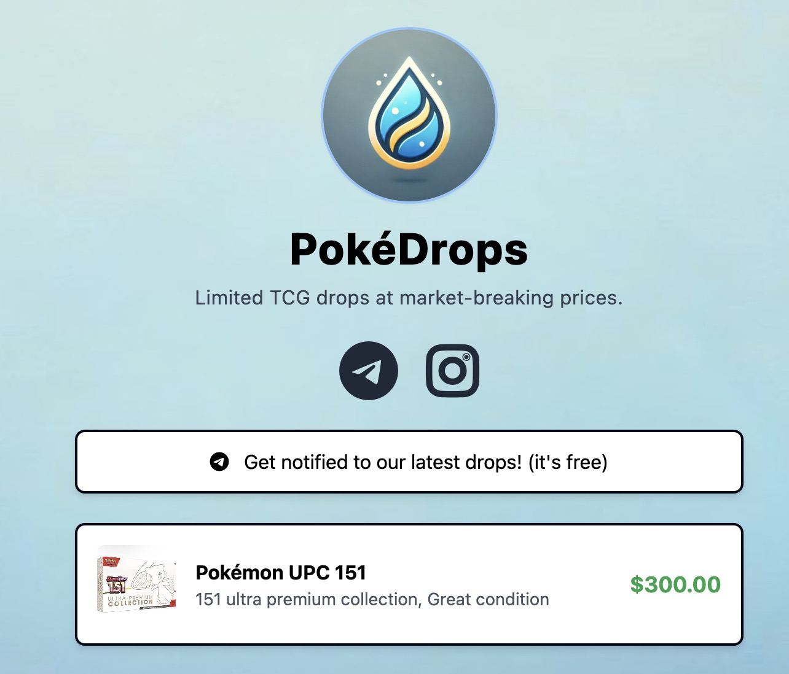

<!-- PROJECT LOGO -->
<br />
<p align="center">
  <h1 align="center">👋 We are PokeDrops</h1>
</p>
<!-- PROJECT LOGO -->

[](https://github.com/calvindotsg/pokedrops-link-in-bio/stargazers)
[](./LICENSE)
[](https://app.netlify.com/sites/calvindotsg/deploys)
[](https://github.com/calvindotsg/pokedrops-link-in-bio/commits/main/)
[](https://github.com/calvindotsg/pokedrops-link-in-bio/forks)

## Overview

A link in bio built with [Astro](https://astro.build), get notified with our various social channels.



## Features

- Link in bio inspired design
- Fully responsive layout
- Optimized for performance, accessibility, and SEO
- CI/CD integration with [Netlify](https://www.netlify.com/)

## Tech Stack

- [Astro](https://astro.build)
- [TailwindCSS](https://tailwindcss.com)
- [Font Awesome](https://fontawesome.com/)
- [Netlify](https://www.netlify.com/)


## Getting Started

1. Clone the repository:
   ```bash
   git clone https://github.com/calvindotsg/pokedrops-link-in-bio
   ```

2. Navigate to the project directory:
   ```bash
   cd pokedrops-link-in-bio
   ```

3. Install dependencies:
   ```bash
   npm install
   ```

4. Start the development server:
   ```bash
   npm run dev
   ```

## Customization

### Updating User Information

To update your information, edit the `config.js` file in the root directory. You can modify the following:

- User details (name, bio, profile image)
- Background color and image
- Social links
- Custom links
- Products

### Changing Profile Photo

1. Add your profile photo to the `/src/images/` directory
2. Update the `profileImage` path in `config.js`

**Note** - You can create a notion like [profile photo here](https://www.avatartion.com/)

### Changing Background

1. To change the background color, update the `background.color` value in `config.js`
2. To use a background image, add the image to `src/images/backgrounds/` and update the `background.image` path in `config.js`

**NOTE** - I've added a few sample background that you can use for free in the `src/images/backgrounds/*` folder.

### Changing Icons

1. Search the [Font Awesome website](https://fontawesome.com/) for a free icon name
2. Update whatever you would like in the `config.js` file

### Ordering Content

The order of links and products is determined by their order in the `config.js` file. To change the order, simply rearrange the items in the `links` and `products` arrays.

## Building for Production

Run `npm run build` to create a production-ready build of your site.

## Deploy

You can deploy this site to any static site hosting platform. We recommend using [Netlify](https://www.netlify.com/) or [Vercel](https://vercel.com/) for easy deployment.

### Deploy on Netlify

To deploy on Netlify:

1. Fork this repository.
2. Link the forked repo to your Netlify account.

Alternatively, deploy directly with this button:

[](https://app.netlify.com/start/deploy?repository=https://github.com/calvindotsg/pokedrops-link-in-bio)

## Acknowledgements

This portfolio is inspired by [Cory's work](https://github.com/ctrimm/) and deployed at [pokedrops.netlify.app](https://pokedrops.netlify.app).